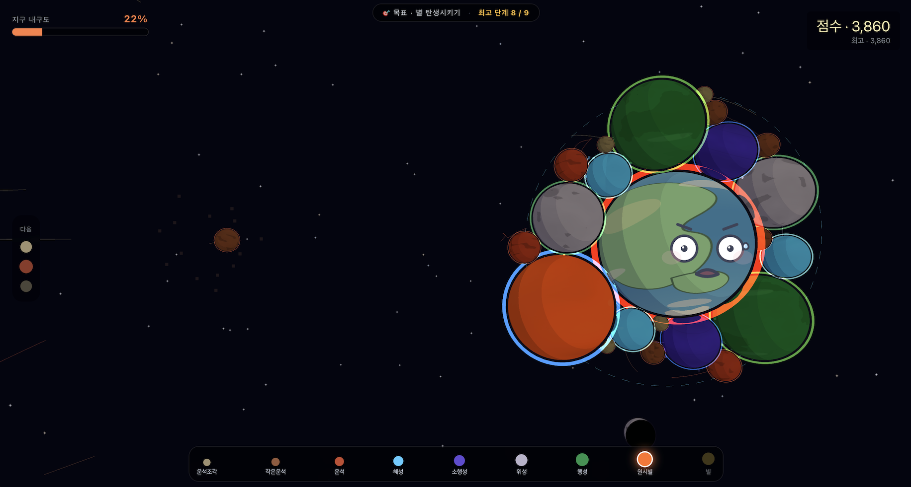

# harness-boot

> [English](README.md) · [한국어](README.ko.md)

> **AI 의 에너지를 가두지 않고, *집중* 시킵니다.**

Claude Code 위에서 도는 multi-agent 개발 하네스. 다른 AI 도구가 *능력* 을 더할 때, harness-boot 는 *방향* 을 만듭니다.

[](.claude-plugin/plugin.json)
[](tests/parity)
[](LICENSE)

---

## 🐎 왜 하네스인가

야생마는 빠르지만 산만합니다. 마구 채운 말은 빠르고 *방향* 이 있습니다.

```
사용자  ──▶  ① 변환  ──▶  ② 진화  ──▶  ③ 집중  ──▶  ④ 협업  ──▶  ⑤ 통합  ──▶  결과
            (컨텍스트)     (문서)      (제어)        (전문가)      (명령 통합)
```

---

## 다섯 가지 강점

| # | 강점 | 어떻게 작동하나 | 사용자가 얻는 것 |
|---|---|---|---|
| 1 | **변환** | 사람의 자연어를 AI 가 이해할 중간언어(명세)로 변환합니다 — 모든 에이전트가 같은 컨텍스트에서 출발합니다 | 모든 에이전트가 같은 맥락에서 출발 — AI 가 헷갈리지 않습니다 |
| 2 | **진화** | 한 곳을 수정하면 관련 문서가 자동 갱신, 불일치는 자동 감지, 사용자가 직접 수정한 부분은 보존됩니다 | 설계 문서가 항상 최신, 관리 부담이 사라집니다 |
| 3 | **집중** | 각 AI 가 자기 작업 범위 안에서만 동작하고, 완료 조건은 시스템이 보장합니다 | AI 가 본래 일에만 집중합니다 |
| 4 | **협업** | 역할별 전문 AI 들이 정해진 절차로 협력하고, 모든 의사결정과 이견 처리 과정이 자동 기록됩니다 | 사각지대를 메우고, 모든 결정 과정이 추적 가능합니다 |
| 5 | **통합** | 외울 명령은 두 개. 자연어로 의도를 말하면 실행 전에 계획을 보여줍니다 | 평소 쓰는 말로 충분합니다 |

---

## 구조

```
        자연어 / plan.md / 기존 코드
                  │
                  ▼
   ┌──────────────────────────────────────────┐
   │  spec.yaml  (단일 원천)                   │
   │   ├─ 아이디어 — 비전 · 사용자             │
   │   └─ 규칙     — 기능 · 결정 · 제약        │
   └──────────┬─────────────────┬─────────────┘
              │                 │
       자동 파생            전문가 협업
              │                 │
              ▼                 ▼
   ┌────────────────┐  ┌──────────────────────┐
   │ domain.md      │  │ orchestrator         │
   │ architecture   │  │  ├─ 기획             │
   │ events.log     │  │  ├─ 설계             │
   │ chapters/      │  │  ├─ 구현             │
   │ 불일치 자동감지│  │  ├─ 품질·통합        │
   └────────────────┘  │  └─ 감사 (read-only) │
                       │  + 협업 절차         │
                       └──────────────────────┘
                                │
                                ▼
                         /harness-boot:work
                  (빈 호출=대시보드 · 자연어=의도)
```

---

## 빠른 시작

Claude Code 에서:

```bash
/plugin marketplace add qwerfunch/harness-boot
/plugin install harness-boot@harness-boot

cd my-new-project
```

상황에 맞는 진입점을 고릅니다 — 두 경우 모두 같은 하네스로 들어갑니다:

```bash
# A. 한 줄 아이디어에서 시작
/harness-boot:init "간단한 할 일 관리 앱"

# B. 이미 가진 기획 문서에서 시작 (plan.md, 설계 노트, 스케치)
/harness-boot:init plan.md
```

이후 모든 피처는 하나의 명령으로 굴립니다:

```bash
/harness-boot:work
```

5 분 이상 걸리면 [issue 알려주세요](https://github.com/qwerfunch/harness-boot/issues).

---

## 수동 설치

포크하거나 컨트리뷰션을 보낼 때, 또는 오프라인 환경에서 사용해야 할 때는 저장소를 직접 받아서 설치합니다. 클론한 디렉토리에 `.claude-plugin/marketplace.json` 이 들어 있어서 그 경로를 그대로 마켓플레이스로 지정할 수 있습니다.

> 참고: harness-boot 는 Claude Code 공식 마켓플레이스에 아직 등록되어 있지 않습니다. 빠른 시작에 안내된 `qwerfunch/harness-boot` 명령은 이 GitHub 저장소를 마켓플레이스로 곧장 등록하는 형태입니다.

```bash
git clone https://github.com/qwerfunch/harness-boot.git
cd harness-boot
```

Claude Code 안에서 클론한 디렉토리의 절대 경로로 마켓플레이스를 등록합니다.

```bash
/plugin marketplace add /Users/your-name/harness-boot
/plugin install harness-boot@harness-boot
```

`/Users/your-name/harness-boot` 자리에는 실제로 클론한 위치를 넣습니다. `pwd` 명령으로 현재 경로를 그대로 복사해 쓰면 편합니다.

새 버전을 받으려면 클론한 디렉토리에서 `git pull` 을 실행한 뒤 Claude Code 에서 `/plugin marketplace update harness-boot` 으로 갱신합니다.

---

## 사용법

### 자연어로 말하기

`/harness-boot:work` 뒤에 평소 쓰는 말투를 그대로 붙이면 됩니다. 짧은 키워드도, 긴 문장도 모두 해석됩니다.

| 의도 | 자연어 예시 |
|---|---|
| 대시보드 / 다음 할 일 | (인자 없음) · "지금 뭐 해야 해?" · "어디까지 했지?" · "다음 할 일 알려줘" |
| 검증 실행 | "테스트" · "돌려봐" · "지금까지 한 거 검증해줘" · "빠진 거 있는지 한번 봐줘" |
| 완료 시도 | "됐어" · "완료" · "이거 끝난 것 같아" · "로그인 기능 마무리할게" |
| 보류 | "막혔어" · "잠시 멈춰" · "외부 API 가 안 나와서 못 진행" · "오늘은 여기까지" |
| 기능 시작 / 전환 | "로그인 기능" · "회원가입 작업할게" · "F-3 시작" · "결제부터 먼저 만들자" |
| 작업 복귀 | "이어서" · "계속" · "어제 하던 거 다시" · "추천하는 거 진행" |
| 근거 추가 | "확인했어" · "리뷰 받았어" · "친구가 봐줬어" · "QA 통과했어" |
| 기능 정리 | "이건 빼자" · "취소해줘" · "F-9 는 안 만들래" |
| 이력 조회 | "지난주에 뭐 했지?" · "F-3 의 변경 이력" · "왜 OAuth 로 갔었지?" |

위 예시는 일부일 뿐, Claude 는 문맥을 보고 다른 표현도 해석합니다. 자신 없는 해석은 실행 전에 계획을 보여주고 Y/n 으로 확인합니다.

### 대화 예시

전형적인 한 사이클 — 피처 시작 → 검증 실행 → 완료.

```
사용자> 로그인 기능 시작할게

Claude> 로그인 기능 (F-3) 시작.
        완료 조건: 스모크 실행 (gate_5) PASS + 근거 1 건 이상.
        다음: 검증 실행.

사용자> 돌려봐

Claude> 테스트              (gate_0)       PASS    — 단위 19 개
        스모크 실행         (gate_5)       PASS    — 근거 자동 기록
        타입/스타일/커버리지 (gate_1/2/3)  SKIPPED — 도구 미감지
        Iron Law 충족 (스모크 실행 + 근거). 로그인 기능 (F-3) 끝낼까요? [Y/n]

사용자> Y

Claude> 완료. 회고 자동 저장: .harness/_workspace/retro/F-3.md
        다음: 회원가입 (F-4). "전환" 또는 "남은 일" 이라고 말하세요.
```

### 대시보드 출력

```
harness-boot

작업 중: "로그인 기능"
  진행: 검증 3/6 통과 · 근거 2 개
  차단: 접근성 · Space 키 동작 미정
대기: "회원가입" · "비밀번호 찾기"
다음 할 일: (1) 다음 검증 실행 (추천)
```

---

## 만들어진 결과물

| 프로젝트 | 미리보기 | 데모 | 소스 | 설명 |
|---|---|---|---|---|
| **cosmic-suika** | <a href="https://qwerfunch.github.io/cosmic-suika-pages/"></a> | [Play](https://qwerfunch.github.io/cosmic-suika-pages/) | [GitHub](https://github.com/qwerfunch/cosmic-suika-pages) | 우주 테마 수박 게임 |
| *여러분 차례* | — | — | — | harness-boot 로 만든 결과물 추가 가능 |

**여러분의 결과물도 환영합니다.** [PR](https://github.com/qwerfunch/harness-boot/pulls) 로 표에 행을 추가해주세요 — 기존 행을 복사해 양식으로 쓰면 됩니다. 양식이 번거로우시면 [issue](https://github.com/qwerfunch/harness-boot/issues) 로 이미지와 한 줄 설명만 보내주셔도 됩니다.

이미지·GIF·스크린샷 무엇이든 — 한 줄 설명과 링크만 함께 보내주세요. 머지 전에 메인테이너가 다듬어 적용합니다.
자세한 가이드는 [`docs/assets/README.md`](docs/assets/README.md).

---

## 레포 구조

```
harness-boot/
├── .claude-plugin/        plugin.json · marketplace.json
├── agents/                전문가 에이전트 정의
├── commands/              슬래시 명령 (init · work)
├── hooks/                 session-bootstrap · prompt-log
├── src/                   TypeScript 구현
├── dist/cli/              esbuild 단일 파일 번들 (commit 됨, 설치 측 node_modules 불필요)
├── bin/harness            번들을 로드하는 Node 셈 — `harness <subcommand>`
├── self_check.sh          5단계 자체 도그푸드 검증
├── skills/spec-conversion/  plan.md → spec.yaml 변환
├── docs/                  스키마 · 템플릿 · 샘플 · 결과물 데모
└── tests/parity/          TS parity 테스트 스위트
```

---

## 현재 상태

**v0.13.2** — 레포 루트 정리 (F-117). v0.13 TS-only 전환 이후 잔존하던 Python 설정 (`pytest.ini`, `requirements-dev.txt`) 제거. 동작 변화 없음.

직전 **v0.13.1** — `feature-author` skill 추가. "X 기능 구현해줘", "X 만들어줘" 같은 한국어 자연어 (또는 "draft a feature", "spec out X" 같은 영어) 에 자동 트리거되어 shape 감지 · project mode 별 AC 개수 · 양쪽 spec.yaml lockstep 안내까지 갖춘 `features[]` entry 한 번에 생성.

- 변경 이력 — [CHANGELOG.md](CHANGELOG.md)
- 개발자 가이드 — [CLAUDE.md](CLAUDE.md)
- 문제 보고 — [GitHub Issues](https://github.com/qwerfunch/harness-boot/issues)

```bash
# 소스에서 빌드/테스트하려는 기여자용 (devDependencies 만 필요 —
# 사용자는 /plugin install 만으로 충분, npm 단계 불필요):
npm install
npm test            # vitest (parity 스위트)
bash self_check.sh  # 5단계 구조 검증
```

---

## 라이선스

[MIT](LICENSE) — Free to use, free to fork.
